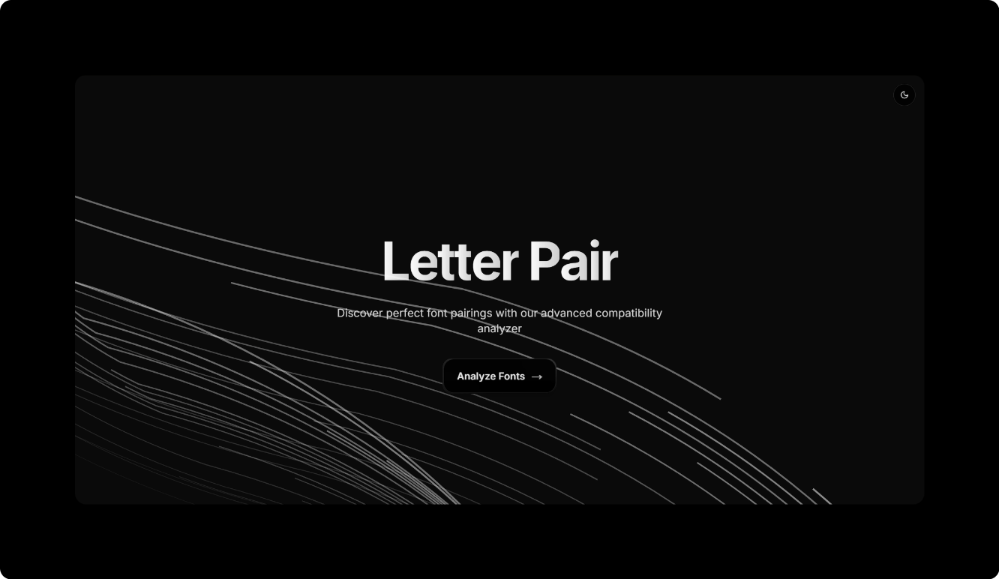

<h1 style="text-align: center;">Letter Pair</h1>

## 🖋️ Overview

Letter Pair is a tool that evaluates and compares font files, extracting key metrics such as x-height, cap-height, stroke contrast, and average character width. It then calculates a compatibility score to help designers and typographers determine how well fonts pair together. With the new 3‑font system support, Letter Pair not only assesses two fonts at a time but also evaluates the overall harmony of a trio of fonts.

## 🚀 Features

-   📏 Compare various fonts and determine a compatibility score between any two.
-   🎨 Analyzes stroke contrast to determine visual consistency.
-   🧮 Computes compatibility scores based on font properties.
-   🔺 Visualizes a 3‑font system using the triangle method to highlight overall diversity.
-   📂 Simple and Intuitive UI.

# **Methodology**

This algorithm evaluates font compatibility by analyzing key typographic characteristics and computing a compatibility score. It employs **stroke contrast analysis**, **x-height comparison**, **character width measurements**, and a **feature vector approach** that quantifies font attributes into numerical representations.

---

## **1. Stroke Contrast Analysis**

Stroke contrast refers to the variation in thickness between different parts of a character's strokes. This feature helps distinguish fonts with pronounced thick-thin transitions (e.g., Didone serifs) from those with uniform strokes (e.g., geometric sans-serifs).

### **SVG Path Extraction**

-   Fonts are converted to SVG paths using `text-to-svg`.
-   Characters are rendered at a large size (300px) for higher accuracy.
-   The SVG path commands are parsed to extract stroke geometry.

### **Stroke Segment Identification**

-   The algorithm processes path commands (M, L, C, Q) to extract stroke data.
-   For each stroke segment, it calculates:
    -   The **distance** between points (potential stroke width).
    -   The **angle** of the segment (to classify direction).

### **Segment Filtering**

-   Segments are filtered based on length:
    -   **Minimum length:** 3% of the font size (eliminates tiny artifacts).
    -   **Maximum length:** 50% of the font size (prevents misinterpretations of outlines).
-   Segments are classified as:
    -   **Horizontal:** ±20° from 0° or 180°.
    -   **Vertical:** ±20° from 90°.
    -   **Diagonal strokes are ignored** to prevent skewed measurements.

### **Contrast Calculation**

-   A **trimmed mean** is computed for horizontal and vertical stroke widths.
-   The contrast ratio is derived from:
    ```
    stroke_contrast = thicker_stroke_width / thinner_stroke_width
    ```
-   The ratio is **capped at 10:1** to avoid extreme values.
-   Multiple contrast-sensitive characters (e.g., 'O', 'H', 'B', 'o', 'e', 'g', 'D', 'G', 'Q', 'p', 'q') are analyzed, and their average contrast ratio is used.

---

## **2. Other Typographic Metrics**

### **x-Height**

-   Measured using the lowercase **"x"**.
-   Normalized by the font size.
-   Reflects the typical height of lowercase letters without ascenders or descenders.

### **Cap Height**

-   Measured using the uppercase **"H"**.
-   Normalized by the font size.
-   Represents the height of capital letters.

### **Average Character Width**

-   Calculated using the width of the lowercase alphabet.
-   Normalized by the font size.
-   Provides insight into the overall proportions of the font.

---

## **3. Feature Vector Representation & Distance Calculation**

Every font is represented as a **feature vector**, a numerical encapsulation of key attributes. This enables mathematical comparisons using Euclidean distance.

### **Feature Vector Definition**

Each font is described as a multi-dimensional vector:

```
Font Vector = [xHeight, capHeight, strokeContrast, avgCharWidth, serif, geometric, aperture]
```

Where:

-   **xHeight:** Normalized height of "x".
-   **capHeight:** Normalized height of "H".
-   **strokeContrast:** Average thick-to-thin stroke ratio.
-   **avgCharWidth:** Average width of lowercase letters.
-   **serif (0–1):** 0 = sans-serif, 1 = serif.
-   **geometric (1–10):** 1 = humanist, 10 = geometric.
-   **aperture (1–10):** 1 = closed, 10 = open.

### **Euclidean Distance Calculation**

The similarity between two fonts is computed using **Euclidean distance**:

```
distance = √[(f1A - f1B)² + (f2A - f2B)² + ... + (fnA - fnB)²]
```

A lower distance indicates greater similarity. For complementary pairings, the algorithm targets:

-   **Low distance** for cohesive elements (x-height, width, weight).
-   **High distance** for contrasting elements (stroke contrast, serif style, geometric form).

---

## **4. Compatibility Score Calculation**

A final **compatibility score (0–1)** is derived from a weighted combination of feature similarity and Euclidean distance:

```
score = (0.35 * xHeightSimilarity) + (0.25 * strokeContrastSimilarity) + (0.2 * widthSimilarity) + (0.2 * featureDistanceScore)
```

-   **Higher score** (closer to 1) indicates more compatible fonts.
-   **Lower score** (closer to 0) indicates less compatible fonts.

The algorithm balances cohesive elements with contrasting features to determine both similarity and complementary potential.

---

## **5. Extending to a 3‑Font System**

When evaluating three fonts simultaneously, the methodology expands to include:

### **Pairwise Compatibility**

-   **Pairwise Analysis:** The algorithm computes compatibility scores for each font pair:
    -   **Font A vs. Font B**
    -   **Font A vs. Font C**
    -   **Font B vs. Font C**
-   **Overall Score:** An overall compatibility score is then calculated as the average of the three pairwise scores.

### **Triangle Method**

In a 3‑font system, each font is represented as a point in a multi-dimensional typographic metric space (using key metrics such as stroke contrast, average character width, and x-height). These points form the vertices of a triangle.

-   **Triangle Area:**
    -   The area of the triangle quantifies the diversity among the fonts.
    -   A **larger area** indicates greater variation in typographic properties (suggesting a more diverse yet potentially complementary system).
    -   A **smaller area** implies that the fonts are more similar.
-   **Triangle Perimeter:**
    -   The perimeter represents the sum of the pairwise distances between the fonts.
    -   A **higher perimeter** suggests more pronounced differences among the fonts.
-   **Visual Analysis:**
    -   Plotting these points in a 2D projection (using methods such as the triangle visualization) allows designers to interactively explore the relationships.
    -   The triangle method provides an intuitive visual summary of the overall balance and contrast within a 3‑font system.

This extended methodology ensures that the selection of font systems is both data-driven and visually interpretable, helping designers to choose combinations that are both cohesive and complementary.

---

## 📦 Tech Stack

-   **Framework:** Next.js
-   **Language:** TypeScript

## 🔧 Setup & Installation

### 1️⃣ Clone the Repository

```sh
git clone https://github.com/AdityaBhattacharya1/letterPair
cd font-compatibility-analyzer
```

### 2️⃣ Install Dependencies

```sh
npm install
```

### 3️⃣ Run the Development Server

```sh
npm run dev
```
